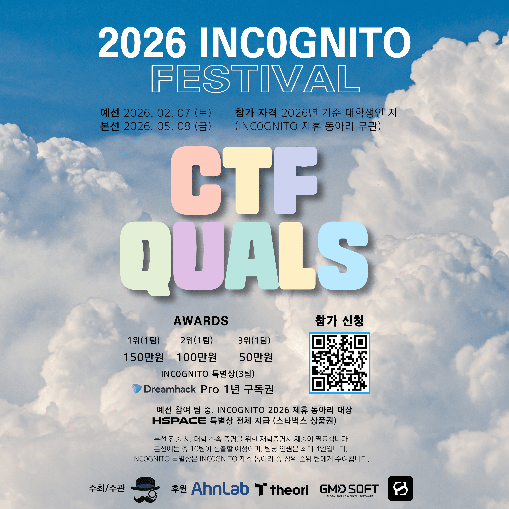

<h1>2026 INC0GNITO FESTIVAL CTF</h1>

  <strong>INC0GNITO CTF Archive</strong>

  <a href="https://dreamhack.io/ctf/792">Quals Site</a> ·
  <a href="https://dreamhack.io/ctf/814">Finals Site</a> ·
  <a href="./docs/final-rules.md">Finals Rules</a>

  주최·주관 <strong>INCOGNITO</strong> 
  후원 <strong>AhnLab · Theori · GMDSOFT · HSPACE</strong>

 

<h2 align="center">Overview</h2>

<table align="center">
  <tr>
    <th></th>
    <th>QUALS</th>
    <th>FINALS</th>
  </tr>
  <tr>
    <th>Participants</th>
    <td align="center"><strong>108 teams / 315 players</strong></td>
    <td align="center"><strong>8 teams / 30 players</strong></td>
  </tr>
  <tr>
    <th>Date</th>
    <td align="center">2026.02.07. 10:00:00 ~ 18:00:00</td>
    <td align="center">2026.05.08. 09:30:00 ~ 17:00:00</td>
  </tr>
  <tr>
    <th>Venue</th>
    <td align="center">온라인</td>
    <td align="center">고려대학교 안암캠퍼스 정운오 IT교양관 519호</td>
  </tr>
  <tr>
    <th>
      
      Platform
    </th>
    <td align="center"><a href="https://dreamhack.io/ctf/792">Dreamhack CTF #792</a></td>
    <td align="center"><a href="https://dreamhack.io/ctf/814">Dreamhack CTF #814</a></td>
  </tr>
  <tr>
    <th>
      
      Discord
    </th>
    <td align="center">Deleted</td>
    <td align="center"><a href="https://discord.gg/5dbkQdsebt">Discord 초대 링크</a></td>
  </tr>
</table>

<h2 align="center">Documents</h2>

<table align="center">
  <tr>
    <th>Document</th>
    <th>Description</th>
  </tr>
  <tr>
    <td><a href="./docs/final-plan.md">본선 운영 기획안</a></td>
    <td>Final operating plan based on the updated tournament structure</td>
  </tr>
  <tr>
    <td><a href="./docs/final-rules.md">본선 규칙</a></td>
    <td>Final rules and participant notices</td>
  </tr>
  <tr>
    <td><a href="https://www.notion.so/2b00f19c72be813fb4ccd0b5c3e8b2cc">회의록 및 운영 정리</a></td>
    <td>Meeting notes and operations archive</td>
  </tr>
</table>

<h2 align="center">Challenges</h2>

<table align="center">
  <tr>
    <th>QUALS</th>
    <th>FINALS</th>
  </tr>
  <tr>
    <td align="center">
      <strong>26 Challenges</strong> 
      <a href="./docs/quals-challenges.md"><strong>QUALS CHALLENGES</strong></a>
    </td>
    <td align="center">
      <strong>19 Challenges</strong> 
      <a href="./docs/finals-challenges.md"><strong>FINALS CHALLENGES</strong></a>
    </td>
  </tr>
</table>

<h2 align="center">Contributions</h2>

<table align="center">
  <tr><td align="center">
     
    <b>jongcoding</b> 
    <b>Lead</b> 
    Overall Operations · Team Coordination
  </td></tr>
</table>

 

<table align="center">
  <tr>
    <td valign="top">
      <h3 align="center">Operations Team</h3>
      
Account Management · Discord Ticket Bot · Support · On-site

      <table>
        <tr><td align="center">
           
          <b>meeeeing</b> 
          <b>Operations Lead</b> 
          Discord · Participant Management 
          Crypto Review · <b>On-site</b>
        </td></tr>
        <tr><td align="center">
           
          <b>yebbis</b> 
          <b>Core Member</b> 
          Operations · Forensics Review · <b>On-site</b>
        </td></tr>
        <tr><td align="center">
           
          <b>chuchuu22</b> 
          <b>Core Member</b> 
          Operations · Pwnable Review · <b>On-site</b>
        </td></tr>
        <tr><td align="center">
           
          <b>nostheblack</b> 
          <b>Core Member</b> 
          Operations · Rules Review · Reversing Review
        </td></tr>
        <tr><td align="center">
           
          <b>gyry012</b> 
          <b>Core Member</b> 
          Operations · Reversing Review
        </td></tr>
      </table>
    </td>
    <td valign="top">
      <h3 align="center">Planning Team</h3>
      
Rules · Scoring · Format Design Live Fire · Operations Framework

      <table>
        <tr><td align="center">
           
          <b>S7nT3E</b> 
          <b>Planning Lead</b> 
          Live Fire · Hybrid Format 
          Scoring · LLM-resistant Rules 
          Pwnable Review · <b>On-site</b>
        </td></tr>
        <tr><td align="center">
           
          <b>hy30nq</b> 
          <b>Core Member</b> 
          Rules Drafting · Live Fire 
          Misc Review · <b>On-site</b>
        </td></tr>
        <tr><td align="center">
           
          <b>govdl</b> 
          <b>Core Member</b> 
          Operations Framework · Live Fire 
          Pwnable Review
        </td></tr>
      </table>
    </td>
    <td valign="top">
      <h3 align="center">Infra Team</h3>
      
Platform · Server · Accounts Monitoring · Incident Response

      <table>
        <tr><td align="center">
           
          <b>tamszero</b> 
          <b>Infra Lead</b> 
          VM Management · Live Fire Deploy 
          Web Review
        </td></tr>
        <tr><td align="center">
           
          <b>sonotri</b> 
          <b>Core Member</b> 
          Infra Operations · Pwnable Review 
          <b>On-site</b>
        </td></tr>
        <tr><td align="center">
           
          <b>guswjddl4313</b> 
          <b>Core Member</b> 
          Environment Fixes · Web Review 
          <b>On-site</b>
        </td></tr>
        <tr><td align="center">
           
          <b>ahrdyrxkddhfl</b> 
          Member 
          Infra Operations · Reversing Review
        </td></tr>
      </table>
    </td>
  </tr>
</table>
