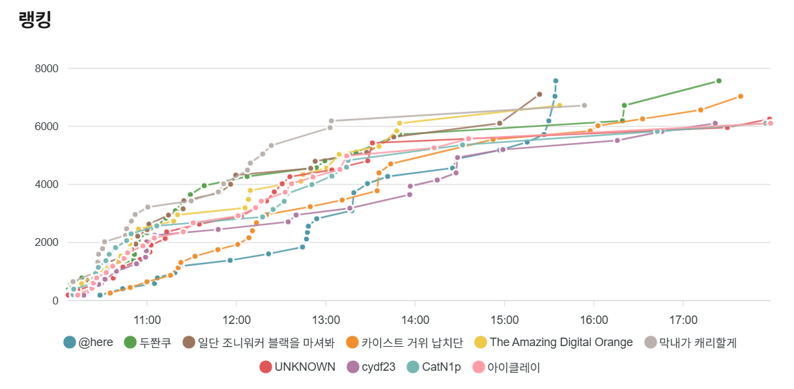

# 2026 INC0GNITO FESTIVAL CTF Quals Challenges

> Linked challenge names are publicly available on Dreamhack Wargame.

| Category | Challenge | Author | Solves |
| --- | --- | --- | ---: |
| web | [edge-gate](https://dreamhack.io/wargame/challenges/2697) | ialleejy | 11 |
| web | [MJSEC Forge Console](https://dreamhack.io/wargame/challenges/2698) | ialleejy | 28 |
| web | [INVISIBLE](https://dreamhack.io/wargame/challenges/2699) | ialleejy | 1 |
| web | [wp-editor](https://dreamhack.io/wargame/challenges/2705) | Tyojong | 34 |
| web | [Mutant](https://dreamhack.io/wargame/challenges/2706) | MEspeaker | 40 |
| web3 | private | entropy | 77 |
| web3 | lock | entropy | 46 |
| web3 | hookThehook | entropy | 29 |
| pwnable | [c4nary in the lake](https://dreamhack.io/wargame/challenges/2702) | sonotri | 64 |
| pwnable | [never_ending](https://dreamhack.io/wargame/challenges/2703) | pwny0 | 38 |
| pwnable | [jitvm](https://dreamhack.io/wargame/challenges/2715) | IQtrekeR | 8 |
| pwnable | [sandbox](https://dreamhack.io/wargame/challenges/2704) | IQtrekeR | 3 |
| reversing | [Breaking Bad](https://dreamhack.io/wargame/challenges/2701) | nutella | 68 |
| reversing | [After the Last Step](https://dreamhack.io/wargame/challenges/2709) | esolxx | 49 |
| reversing | [On Labor and Automation 1](https://dreamhack.io/wargame/challenges/2710) | juhyun167 | 55 |
| reversing | [On Labor and Automation 2](https://dreamhack.io/wargame/challenges/2711) | juhyun167 | 44 |
| forensics | [Don't miss the data](https://dreamhack.io/wargame/challenges/2707) | lnsndus | 35 |
| forensics | [aldks](https://dreamhack.io/wargame/challenges/2714) | moo | 36 |
| forensics | [The Missing Image Fragment](https://dreamhack.io/wargame/challenges/2713) | cywl | 50 |
| crypto | Just Algebra | meeeeing | 47 |
| crypto | [The Twin Paradox](https://dreamhack.io/wargame/challenges/2708) | Berrypie | 75 |
| misc | sidestep__ | 배훈상 | 51 |
| misc | [Phantom_Signal](https://dreamhack.io/wargame/challenges/2700) | Ratel | 79 |
| misc | [Neural_Fortress](https://dreamhack.io/wargame/challenges/2716) | hy3Onq | 32 |
| misc | [Where you at](https://dreamhack.io/wargame/challenges/2717) | 세인님 | 14 |
| misc, reversing | [Time Travel 1](https://dreamhack.io/wargame/challenges/2712) | leehojune | 29 |
